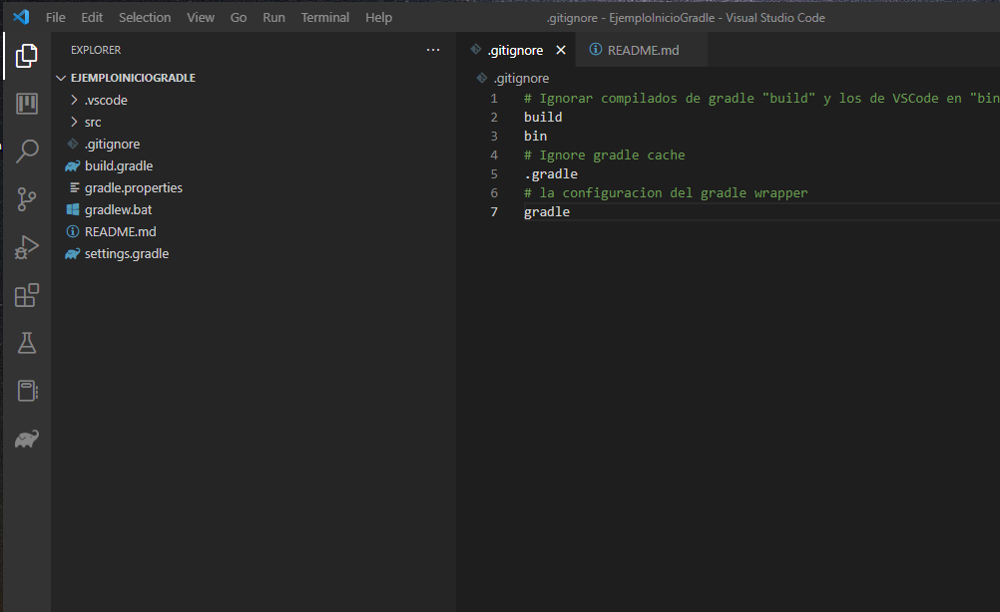
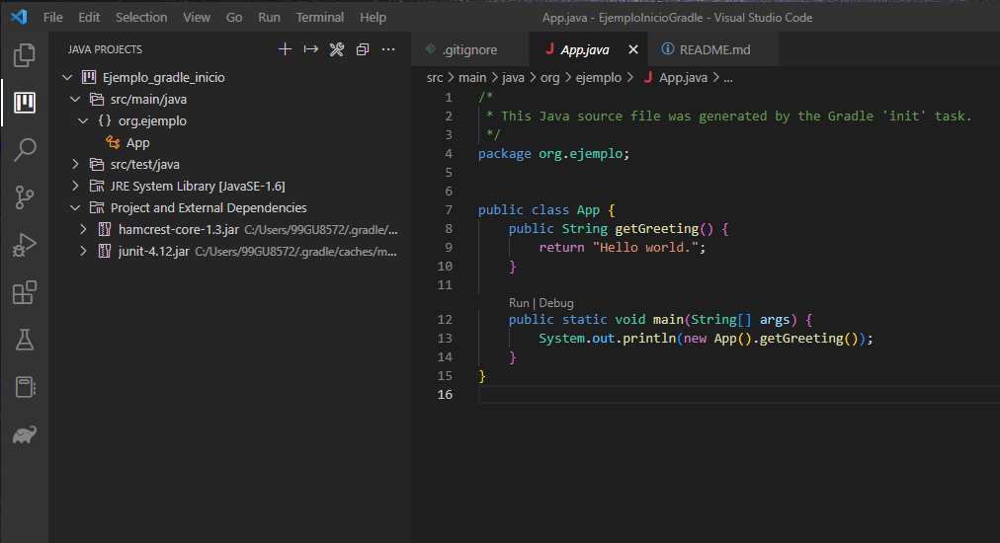
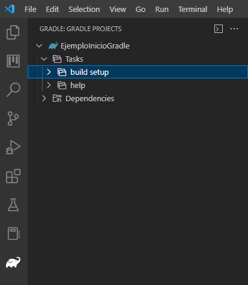

# Ejemplo de inicio proyecto gradle para entorno legacy

Tratamos como iniciar un proyecto de una aplicacion java con gradle comando `gradle init` 
para generar la estructura de un proyecto Gradle.                   
También mostramos los cambios necesarios para que sea compatible con una aplicación legacy
para que tanto gradle como VSCode entiendan que estan trabajando 
con las versiones de Gradle 5.6 y JDK 6.

# Ejecutar app
1. Compilar `gradlew build`
2. Ejecutar `java -jar build/libs/GradleConLibreriasPropias.jar`

# Plugins para VS Code
Instalar el plugin `Extension Pack for Java` y el plugin `Gradle for Java` en VS Code

# Gradle 5.6
Actualmente la última version de gradle 7.4 pero tenemos instala la versión LTS 5.6 que usa JDK8 y vemos que es [compatible.](https://docs.gradle.org/current/userguide/compatibility.html)
Tenemos el gradle 5.6 que usa el JDK8, pero el proyecto gradle es para el JDK6. 

## Definir el gradle 5.6 para VS Code
En el `.vscode/settings.json` añadimos
```
    "java.import.gradle.version": "5.6",
    "java.import.gradle.wrapper.enabled": true,
```
## Definir el gradle wrapper 5.6
Cuando hacemos `gradle init` se nos genera varios archivos, varios binarios para ejecutar el wrapper.
El wrapper nos permite ejecutar una version especifica de gradle, independientemete de si tenemos instalado el gradle en nuestro equipo o no, lo cual es muy necesario sobre todo en software legacy, pero subir binarios a un repositorio git, es mala idea, pero lo que vamos a eliminar (o poner en el .gitignore) los archivos que nos genera el `gradle` init que no son estrictamente necesarios. 

Tenemos el directorio `.gradle` que es la cache de gradle y guarda binarios, se puede eliminar.
También hay dos scripts unos sh `gradlew` y otro cmd `gradlew.bat`, si en noestro entorno solo vamos a usar Windows ponemos eliminar el script `gradlew` para entornos linux.
Por último, tenemos la carpeta `gradle` 
```
├───gradle
│   └───wrapper
│           gradle-wrapper.jar
│           gradle-wrapper.properties
```
que contiene un binario `gradle-wrapper.jar` pero también contiene información relevante sobre la version de wrapper que estamos usando, en el archivo de propiedades `gradle-wrapper.properties` tenemos la versión en la linea `distributionUrl=https\://services.gradle.org/distributions/gradle-5.6-bin.zip`.
Cuando eliminamos este directorio y comprobamos el wrapper `gradlew -v` nos da un error así:
```
C:\Users\Ruben\EjemploGradle>gradlew -v
Error: no se ha encontrado o cargado la clase principal org.gradle.wrapper.GradleWrapperMainR
```
Pero lo podemos solucionar creado la siguiente función en el `build.gradle`
```
task wrapper(type: Wrapper) {
    gradleVersion = '5.6'
}
```
Cuando invocamos esta funcion nos crea el wrapper 
```
C:\Users\Ruben\EjemploGradle>gradle wrapper
To honour the JVM settings for this build a new JVM will be forked. Please consider using the daemon: https://docs.gradle.org/5.6/userguide/gradle_daemon.html.
Daemon will be stopped at the end of the build stopping after processing

BUILD SUCCESSFUL in 5s
1 actionable task: 1 executed
C:\Users\Ruben\EjemploGradle>gradlew -v

------------------------------------------------------------
Gradle 5.6
------------------------------------------------------------

Build time:   2019-07-14 11:05:25 UTC
Revision:     xxxxxxxxxxxxxxxxxxxxxxxxxxxxxxxxxxxxxx

Kotlin:       1.3.41
Groovy:       2.5.4
Ant:          Apache Ant(TM) version 1.9.14 compiled on March 12 2019
JVM:          1.8.0_251 (Oracle Corporation 25.251-b08)
OS:           Windows 10 10.0 amd64
```
Aun así hay que tener en cuenta, que necesitamos que el equipo tengo instalado gradle. En nuestro entorno de trabajo sabiendo que tenemos instalado gradle, es muy conveniedo eliminar el directorio `gradle` para evitar subir binarios, es caso de publicar un proyecto al mundo, como no sabemos si la persona que se lo descarga usa Window o tiene o no tiene instalado gradle, es mejor dejar los archivos tal cual para evitar errores.

# JDK 6
Aunque definimos el proyecto gradle como java 6, sino definimos la ruta del JDK6, seguirá
usando el JDK del sistema que vemos en `java -version`.

## Definir el JDK 6 en VS Code
Definimos las rutas del JDK6 y 8 en el archivo de configuración de VS Code `.vscode/settings.json` así:
```
    "java.configuration.runtimes": [
		{
        "name": "JavaSE-1.8",
        "path": "C:/WORK/APPS/java/jdk1.8.0_251",
        "default": true,
        },
        {
          "name": "JavaSE-1.6",
          "path": "C:/WORK/APPS/java/jdk1.6",
        },
    ]
```

## Definir el JDK 6 en Gradle
En el archivo `build.gradle` definimos la version con la que queremos que compile
[Documentacion para definir version de Java](https://docs.gradle.org/5.6.4/userguide/building_java_projects.html)
```
sourceCompatibility = "1.6"
targetCompatibility = "1.6"
```

# Iniciar proyecto en VS Code
Para iniciar el proyecto, primero configurar las credenciales de artifactory,
del proxy y las rutas de los JDK. Por lo que si no usamos estas herramientas,
no van a funcionar los pasos siguientes. Esta guia es para iniciar el proyecto
si estuvieramos en el entorno correcto. 
1. Hacer `gradlew build` en el directorio del proyecto para descargar el wrapper 5.6
2. Abrirlo con VSCode con los plugins `Extension Pack for Java` y  `Gradle for Java`
3. Añado la ruta de los JDK en VSCode en `EJEMPLO_INICIO_GRADLE/.vscode/settings.json`
3. Si gradle detecta la version 5.6, mostrará los dependencias en la vista de gradle correctamente.


# Los pasos de como se ha iniciado este proyecto
Para crear el proyecto gradle, creamos un directorio y iniciamos el proyecto con gradle que nos crear la estructura de archivos
```
C:\Users\Ruben>mkdir ejemploGradle

C:\Users\Ruben>cd ejemploGradle

C:\Users\Ruben\ejemploGradle>gradle init
To honour the JVM settings for this build a new JVM will be forked. Please consider using the daemon: https://docs.gradle.org/5.6/userguide/gradle_daemon.html.
Daemon will be stopped at the end of the build stopping after processing

Select type of project to generate:
  1: basic
  2: application
  3: library
  4: Gradle plugin
Enter selection (default: basic) [1..4] 2

Select implementation language:
  1: C++
  2: Groovy
  3: Java
  4: Kotlin
  5: Swift
Enter selection (default: Java) [1..5] 3

Select build script DSL:
  1: Groovy
  2: Kotlin
Enter selection (default: Groovy) [1..2] 1

Select test framework:
  1: JUnit 4
  2: TestNG
  3: Spock
  4: JUnit Jupiter
Enter selection (default: JUnit 4) [1..4] 1

Project name (default: ejemploGradle):
Source package (default: ejemploGradle): org.ejemplo

> Task :init
Get more help with your project: https://docs.gradle.org/5.6/userguide/tutorial_java_projects.html

BUILD SUCCESSFUL in 31s
2 actionable tasks: 2 executed
C:\Users\Ruben\ejemploGradle>tree /f
Listado de rutas de carpetas para el volumen Windows
El número de serie del volumen es 6C13-5F3C
C:.
│   .gitignore
│   build.gradle
│   gradlew
│   gradlew.bat
│   settings.gradle
│
├───.gradle
│   ├───5.6
│   │   │   gc.properties
│   │   │
│   │   ├───executionHistory
│   │   │       executionHistory.bin
│   │   │       executionHistory.lock
│   │   │
│   │   ├───fileChanges
│   │   │       last-build.bin
│   │   │
│   │   └───fileHashes
│   │           fileHashes.bin
│   │           fileHashes.lock
│   │
│   └───buildOutputCleanup
│           buildOutputCleanup.lock
│           cache.properties
│           outputFiles.bin
│
├───gradle
│   └───wrapper
│           gradle-wrapper.jar
│           gradle-wrapper.properties
│
└───src
    ├───main
    │   ├───java
    │   │   └───org
    │   │       └───ejemplo
    │   │               App.java
    │   │
    │   └───resources
    └───test
        ├───java
        │   └───org
        │       └───ejemplo
        │               AppTest.java
        │
        └───resources
```


## Las diferentes vistas en VS Code





